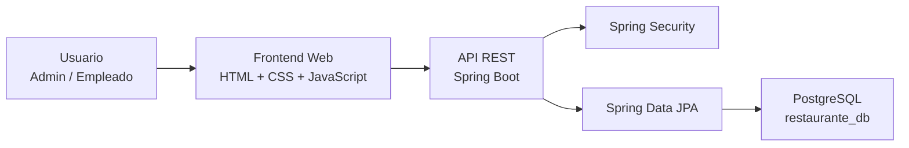
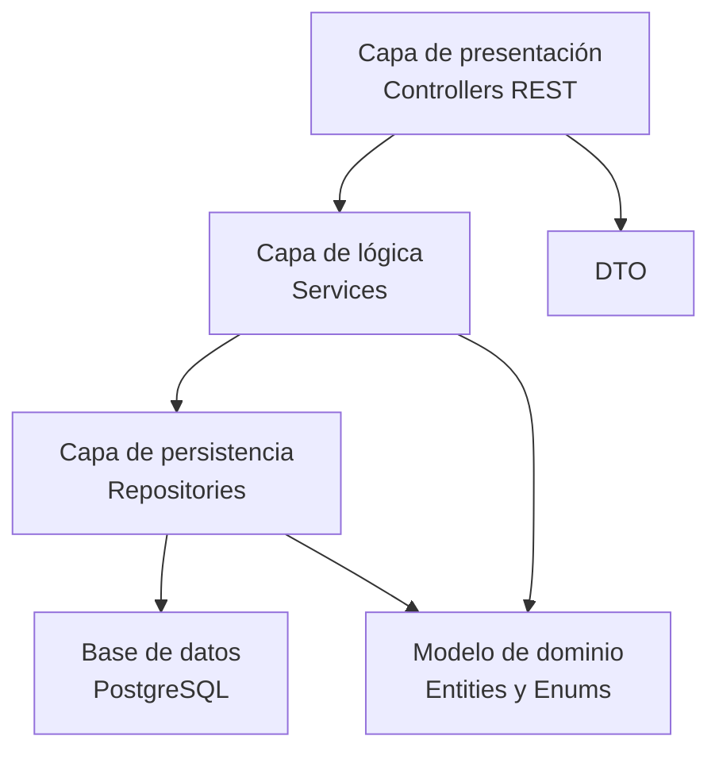
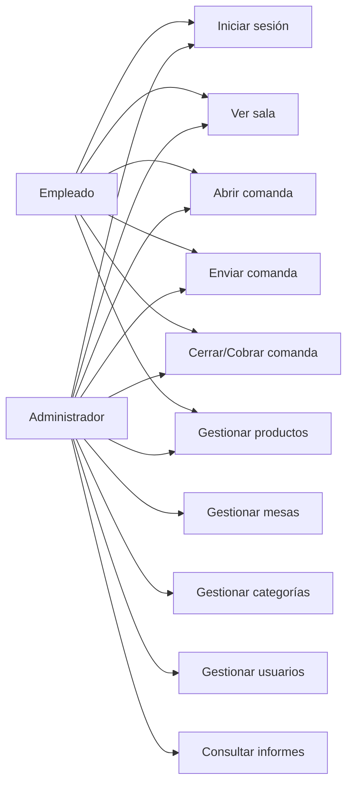
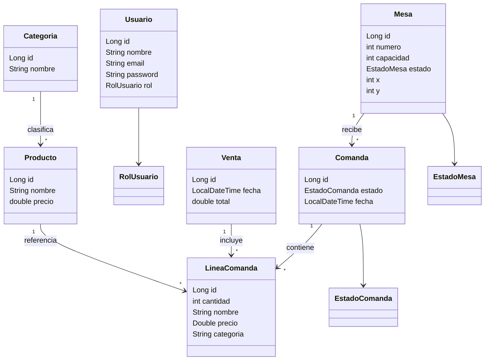
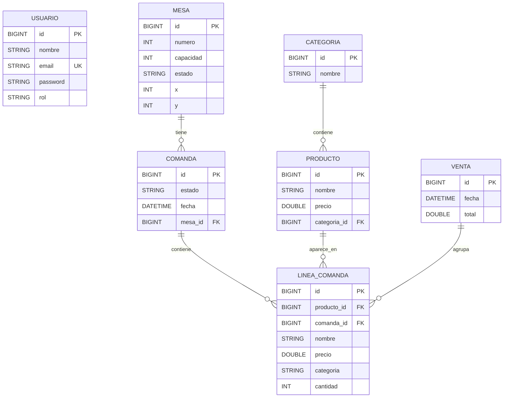
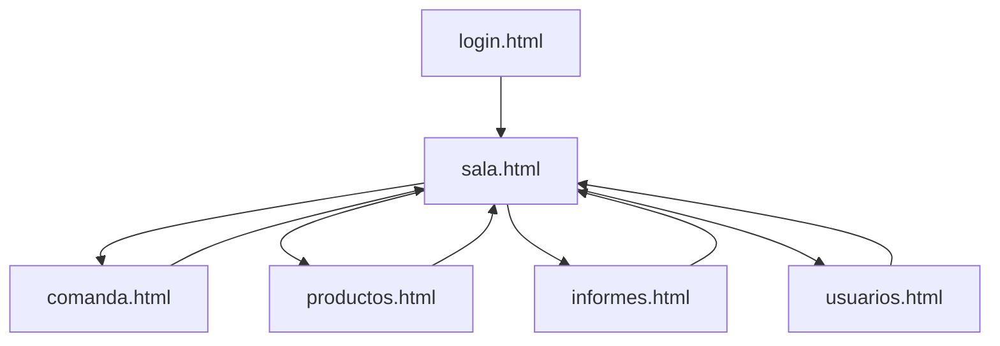
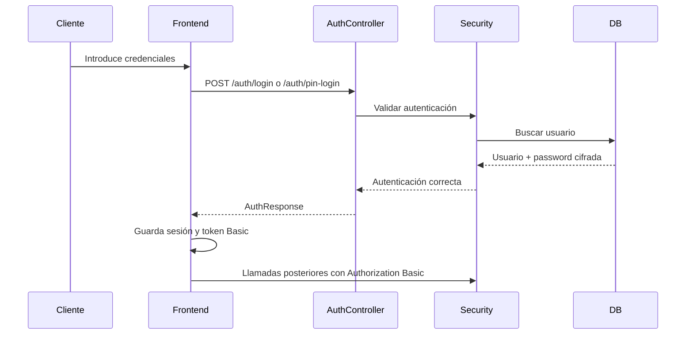
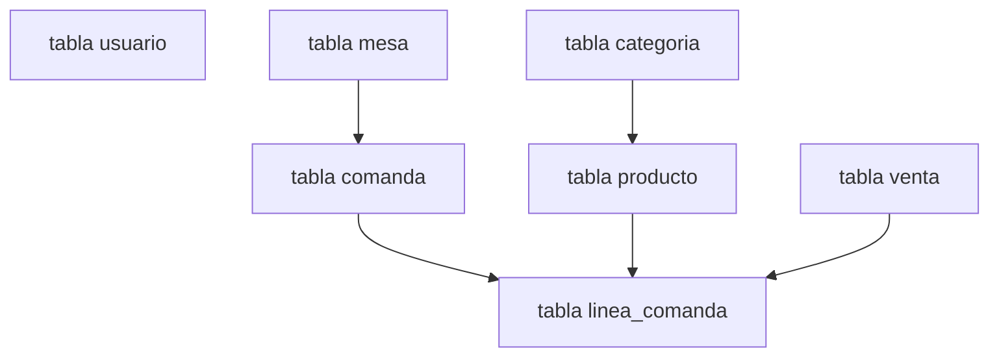

# Documentación Completa de Orsy

## 1. Introducción

Orsy es una aplicación de gestión de restaurante dividida en dos partes:

- Un backend desarrollado con **Spring Boot**, responsable de la lógica de negocio, la persistencia de datos, la autenticación y la exposición de una API REST.
- Un frontend web ligero desarrollado con **HTML, CSS y JavaScript**, responsable de la interacción con el usuario en pantallas como login, sala, comanda, productos, informes y usuarios.

El objetivo del sistema es permitir la gestión operativa de un restaurante:

- Inicio de sesión de administradores y empleados.
- Visualización y gestión de mesas en sala.
- Creación y seguimiento de comandas.
- Gestión de productos y categorías.
- Gestión de usuarios.
- Consulta de informes de ventas.

---

## 2. Tecnologías utilizadas

### Backend

- Java 17
- Spring Boot 4
- Spring Web MVC
- Spring Data JPA
- Spring Security
- PostgreSQL
- Gradle

### Frontend

- HTML5
- CSS3
- JavaScript vanilla
- Chart.js para los gráficos de informes

---

## 3. Estructura general del proyecto

### Backend

Ruta principal:

`/Users/marinamr/Documents/GitHub/orsy`

Paquetes principales:

- `config`: inicialización de datos.
- `controller`: controladores REST.
- `dto`: objetos de transferencia.
- `model`: entidades y enums del dominio.
- `repository`: acceso a datos.
- `security`: configuración de autenticación y autorización.
- `service`: lógica de negocio reutilizable.

### Frontend

Ruta principal:

`/Users/marinamr/Documents/GitHub/Orsy_TFG`

Archivos principales:

- `login.html`
- `sala.html`
- `comanda.html`
- `productos.html`
- `informes.html`
- `usuarios.html`
- `css/styles.css`
- `js/auth.js`
- `js/app.js`
- `js/productos.js`
- `js/informes.js`
- `js/usuarios.js`

---

## 4. Funcionamiento del programa paso por paso

## 4.1. Arranque del backend

1. Se ejecuta la aplicación Spring Boot desde `OrsyApplication`.
2. Spring carga la configuración general, la seguridad, los repositorios JPA y los controladores.
3. Se establece la conexión con PostgreSQL usando `application.properties`.
4. Hibernate actualiza la estructura de la base de datos con `spring.jpa.hibernate.ddl-auto=update`.
5. `UsuarioInitializer` revisa los usuarios existentes:
   - Migra contraseñas antiguas si estaban sin cifrar.
   - Asigna el rol `EMPLEADO` si algún usuario no lo tenía informado.
   - Crea el administrador por defecto si no existe.

## 4.2. Inicio de sesión

### Escritorio

1. El usuario abre `login.html`.
2. Introduce email y PIN de 4 dígitos.
3. `auth.js` envía una petición `POST /auth/login`.
4. El backend autentica al usuario mediante Spring Security.
5. Si el login es válido, el frontend guarda la sesión en `sessionStorage`.
6. El usuario es redirigido a `sala.html`.

### Tablet y móvil

1. El usuario abre `login.html`.
2. `auth.js` detecta el tamaño de pantalla y oculta el campo de email.
3. Se muestra un teclado numérico redondo para introducir el PIN.
4. Al completar 4 dígitos, `auth.js` envía `POST /auth/pin-login`.
5. El backend localiza al usuario cuyo PIN coincide.
6. Si es correcto, devuelve su perfil y el frontend guarda la sesión.
7. El usuario accede a `sala.html`.

## 4.3. Acceso a la sala

1. Al entrar en `sala.html`, se carga `js/auth.js`.
2. Se comprueba que exista sesión válida.
3. Se inserta el nombre del usuario en la barra superior.
4. `js/app.js` llama a `GET /mesas`.
5. El backend devuelve la lista de mesas con su posición, estado y capacidad.
6. El frontend dibuja cada mesa en el plano usando coordenadas `x` e `y`.
7. Si el usuario es empleado, se ocultan los botones de edición de sala.
8. Si el usuario es administrador, puede crear, modificar, borrar y recolocar mesas.

## 4.4. Entrada en una comanda

1. El usuario pulsa sobre una mesa en la sala.
2. Si la mesa estaba libre, se solicita el número de clientes.
3. El navegador redirige a `comanda.html?mesaId=...`.
4. `app.js` obtiene el `mesaId` desde la URL.
5. Se consulta `GET /mesas/{id}` para recuperar el número de la mesa.
6. Se consulta `GET /comandas/mesa/{mesaId}` para ver si existe una comanda abierta.
7. Si existe, se cargan sus líneas en el ticket.
8. También se cargan los productos para poder añadir nuevos artículos.

## 4.5. Añadir productos al ticket

1. `renderProductos()` obtiene la lista de productos desde `GET /productos`.
2. Los productos se agrupan por categoría.
3. El usuario selecciona una categoría.
4. El usuario pulsa sobre un producto.
5. El sistema lo añade al ticket o incrementa la cantidad si ya existía.
6. `renderTicket()` recalcula el total y actualiza la lista visual.

## 4.6. Enviar una comanda

1. El usuario pulsa `Enviar`.
2. El frontend crea un `ComandaDTO` con:
   - `mesaId`
   - `estado`
   - lista de líneas con `productoId` y `cantidad`
3. Se envía `POST /comandas`.
4. El backend:
   - Busca la mesa.
   - Crea la comanda.
   - Crea las líneas.
   - Relaciona cada línea con la comanda.
   - Guarda todo en cascada.
5. Después el frontend llama a `PUT /mesas/{id}/estado` para marcar la mesa como ocupada.
6. Finalmente se vuelve a `sala.html`.

## 4.7. Cerrar o cobrar una comanda

### Cerrar

1. Si no existe una comanda activa persistida, primero se guarda.
2. Se llama a `PUT /comandas/{id}` con estado `CERRADA`.
3. Se cambia el estado de la mesa a `PENDIENTE`.
4. Se limpia el ticket y se vuelve a la sala.

### Cobrar

1. Si no existe comanda activa, primero se guarda.
2. Se llama a `PUT /comandas/{id}` con estado `COBRADA`.
3. Se cambia el estado de la mesa a `LIBRE`.
4. Se limpia el ticket.
5. La comanda cobrada pasa a alimentar los informes.

## 4.8. Gestión de productos

1. `productos.html` consulta `GET /productos` y `GET /categorias`.
2. Se construye el filtro de categorías.
3. Se muestran los productos agrupados por categoría.
4. El administrador puede:
   - Crear categoría.
   - Crear producto.
   - Editar producto.
   - Borrar producto.
5. El empleado solo puede consultar.

## 4.9. Gestión de usuarios

1. `usuarios.html` solo es accesible para administradores.
2. Se consulta `GET /usuarios`.
3. Se muestran tarjetas con nombre, email y rol.
4. El administrador puede:
   - Crear usuario.
   - Editar usuario.
   - Borrar usuario.
5. Al crear o editar, el campo `password` se usa como PIN de 4 dígitos.

## 4.10. Informes

1. `informes.html` solo es accesible para administradores.
2. Se llama a `GET /comandas`.
3. Se filtran solo las comandas con estado `COBRADA`.
4. Se calculan:
   - Total del día.
   - Número de tickets.
   - Ticket medio.
   - Producto más vendido.
5. Se generan tres gráficos:
   - Resumen diario.
   - Top productos.
   - Ventas por categoría.

---

## 5. Explicación de las funciones usadas

## 5.1. Backend

### 5.1.1. Clase principal

#### `OrsyApplication`

- Punto de entrada de la aplicación.
- Arranca el contexto de Spring Boot.

### 5.1.2. Configuración

#### `UsuarioInitializer`

Funciones:

- `run(String... args)`
  - Se ejecuta al arrancar la aplicación.
  - Lanza la migración de usuarios y crea el admin por defecto.

- `migrarPasswordsAntiguas()`
  - Recorre los usuarios.
  - Si una contraseña no está cifrada, la cifra.
  - Si un usuario no tiene rol, le asigna `EMPLEADO`.

- `crearAdminPorDefectoSiNoExiste()`
  - Crea el usuario `admin@orsy.local` si no existe.
  - Su PIN por defecto es `4321`.

### 5.1.3. Servicio

#### `UsuarioService`

Funciones:

- `listar()`
  - Devuelve todos los usuarios.

- `crear(Usuario usuario)`
  - Normaliza el email.
  - Valida que el PIN tenga 4 dígitos.
  - Comprueba que no esté repetido.
  - Cifra el PIN y guarda el usuario.

- `actualizar(Long id, Usuario usuarioActualizado)`
  - Busca el usuario existente.
  - Actualiza nombre, email, rol y PIN si se informa.

- `borrar(Long id)`
  - Elimina un usuario por id.

- `normalizarEmail(String email)`
  - Limpia espacios y convierte a minúsculas.

- `validarPin(String pin)`
  - Exige exactamente 4 dígitos.

- `validarPinUnico(String pin, Long usuarioIdActual)`
  - Comprueba que ese PIN no coincida con el de otro usuario.

- `buscarPorPin(String pin)`
  - Busca un usuario cuyo PIN cifrado coincida con el PIN recibido.
  - Se usa para móvil y tablet.

### 5.1.4. Seguridad

#### `SecurityConfig`

Funciones:

- `securityFilterChain(...)`
  - Desactiva CSRF.
  - Activa CORS.
  - Configura sesiones `STATELESS`.
  - Permite `/auth/login` y `/auth/pin-login`.
  - Protege el resto de rutas.
  - Usa autenticación HTTP Basic.

- `authenticationProvider(...)`
  - Configura el proveedor DAO con `CustomUserDetailsService`.

- `authenticationManager(...)`
  - Expone el `AuthenticationManager`.

- `passwordEncoder()`
  - Usa `BCryptPasswordEncoder`.

- `corsConfigurationSource()`
  - Permite peticiones desde cualquier origen.

#### `CustomUserDetailsService`

Funciones:

- `loadUserByUsername(String username)`
  - Busca un usuario por email.
  - Devuelve un `UserDetails` de Spring Security con:
    - email
    - password cifrada
    - rol convertido a `ROLE_ADMIN` o `ROLE_EMPLEADO`

### 5.1.5. Controladores

#### `AuthController`

Funciones:

- `login(LoginRequest request)`
  - Login por email y PIN.
  - Usa `AuthenticationManager`.
  - Devuelve `AuthResponse`.

- `loginConPin(LoginRequest request)`
  - Login por PIN sin email.
  - Busca el usuario por PIN.
  - Devuelve `AuthResponse`.

#### `MesaController`

Funciones:

- `getAll()`
  - Devuelve todas las mesas.

- `getById(Long id)`
  - Devuelve una mesa concreta.

- `crear(Mesa m)`
  - Crea una mesa.

- `actualizar(Long id, Mesa m)`
  - Actualiza número, capacidad, estado y posición.

- `cambiarEstado(Long id, MesaEstadoDTO dto)`
  - Modifica solo el estado de una mesa.

- `borrar(Long id)`
  - Elimina la mesa.

#### `ProductoController`

Funciones:

- `obtenerTodos()`
  - Devuelve productos en formato `ProductoDTO`.

- `crear(Producto p)`
  - Crea producto asociado a una categoría.

- `actualizar(Long id, Producto p)`
  - Modifica nombre, precio y categoría.

- `borrar(Long id)`
  - Elimina un producto.

#### `CategoriaController`

Funciones:

- `obtenerTodas()`
  - Devuelve todas las categorías.

- `crear(Categoria categoria)`
  - Crea una categoría.

- `actualizar(Long id, Categoria c)`
  - Modifica el nombre de la categoría.

- `borrar(Long id)`
  - Elimina una categoría.

#### `ComandaController`

Funciones:

- `crear(ComandaDTO dto)`
  - Crea una nueva comanda y sus líneas.

- `getActiva(Long mesaId)`
  - Devuelve la comanda abierta de una mesa.

- `getAll()`
  - Devuelve todas las comandas.

- `actualizar(Long id, ComandaDTO dto)`
  - Actualiza el estado de una comanda.

- `borrar(Long id)`
  - Elimina una comanda.

#### `UsuarioController`

Funciones:

- `getAll()`
  - Devuelve todos los usuarios.

- `crear(Usuario u)`
  - Crea un nuevo usuario.

- `actualizar(Long id, Usuario u)`
  - Actualiza un usuario.

- `borrar(Long id)`
  - Elimina un usuario.

#### `VentaController`

Funciones:

- `getAll()`
  - Devuelve todas las ventas.

- `crear(Venta v)`
  - Registra una venta.

### 5.1.6. Repositorios

- `MesaRepository`
  - Acceso a mesas.
- `ProductoRepository`
  - Acceso a productos.
- `CategoriaRepository`
  - Acceso a categorías.
- `ComandaRepository`
  - Acceso a comandas.
- `UsuarioRepository`
  - Acceso a usuarios.
- `VentaRepository`
  - Acceso a ventas.

### 5.1.7. Modelos y DTO

#### Entidades

- `Mesa`
  - Guarda número, capacidad, estado y coordenadas del plano.

- `Producto`
  - Guarda nombre, precio y categoría.

- `Categoria`
  - Agrupa productos.

- `Comanda`
  - Guarda mesa, fecha, estado y líneas.

- `LineaComanda`
  - Guarda producto, cantidad, nombre, precio y categoría copiados.

- `Usuario`
  - Guarda nombre, email, PIN cifrado y rol.

- `Venta`
  - Guarda fecha, total y líneas vendidas.

#### DTO

- `LoginRequest`
  - Entrada del login.

- `AuthResponse`
  - Salida del login.

- `ProductoDTO`
  - Producto adaptado al frontend.

- `ComandaDTO`
  - Comanda adaptada al frontend.

- `LineaDTO`
  - Línea mínima con `productoId` y `cantidad`.

- `MesaEstadoDTO`
  - DTO para cambiar el estado de una mesa.

#### Enums

- `RolUsuario`
  - `ADMIN`, `EMPLEADO`

- `EstadoMesa`
  - Estado operativo de una mesa.

- `EstadoComanda`
  - `ABIERTA`, `CERRADA`, `COBRADA`

---

## 5.2. Frontend

### 5.2.1. `js/auth.js`

Funciones:

- `getAuthSession()`
  - Recupera la sesión desde `sessionStorage`.

- `saveAuthSession(session)`
  - Guarda la sesión.

- `clearAuthSession()`
  - Borra la sesión.

- `getCurrentUser()`
  - Devuelve el usuario autenticado.

- `isAdmin()`
  - Comprueba si el usuario actual es administrador.

- `buildBasicToken(email, password)`
  - Construye el token Basic para la API.

- `getAuthHeaders()`
  - Devuelve la cabecera `Authorization`.

- `redirectToLogin()`
  - Redirige a `login.html`.

- `requireAuth()`
  - Verifica si hay sesión.

- `apiFetch(url, options)`
  - Wrapper de `fetch`.
  - Añade autenticación.
  - Gestiona el `401`.

- `hydrateTopbar()`
  - Inserta nombre y rol del usuario.
  - Añade el botón de cerrar sesión.

- `hideForEmpleado(selectors)`
  - Oculta botones para empleados.

- `enforceRoleAccess()`
  - Bloquea informes y usuarios para empleados.

- `isMobileViewport()`
  - Comprueba si la pantalla es móvil.

- `isDeviceViewport()`
  - Comprueba si la pantalla es tablet o móvil.

- `enforceMobileNavigation()`
  - En dispositivos solo permite `login`, `sala` y `comanda`.

- `configureLoginView()`
  - Ajusta la interfaz de login según el tamaño.

- `configureDeviceNavigation()`
  - Oculta enlaces de la sidebar en dispositivos.

- `renderPinDots(value)`
  - Pinta el estado de los puntos del PIN.

- `updatePinValue(nextValue)`
  - Actualiza el valor interno del PIN.

- `setupPinPad(loginForm)`
  - Gestiona el teclado redondo de PIN.

- `handleLoginSubmit(event)`
  - Gestiona el envío del formulario de login.

- `loginWithCredentials(email, password)`
  - Login con email y PIN.

- `loginWithPin(pin)`
  - Login solo con PIN.

### 5.2.2. `js/app.js`

Funciones de sala:

- `cargarMesasBackend()`
  - Obtiene las mesas desde el backend.

- `renderMesas()`
  - Dibuja las mesas en el plano.

- `aplicarTamanoPlano(container)`
  - Ajusta el tamaño mínimo del plano manteniendo posiciones originales.

- `preguntarNumeroClientes(mesa)`
  - Solicita el número de clientes.

- `configurarBotonEdicion()`
  - Activa y desactiva el modo edición.

- `configurarCrearMesa()`
  - Crea una mesa nueva.

- `configurarModificarMesa()`
  - Cambia el número de una mesa.

- `configurarBorrarMesa()`
  - Borra una mesa.

- `habilitarDrag(elemento, mesa)`
  - Permite arrastrar una mesa en modo edición.

- `guardarPlano(mesaActualizada)`
  - Guarda la nueva posición de la mesa en backend.

Funciones de comanda:

- `renderProductos()`
  - Obtiene productos y monta las categorías.

- `renderProductosPorCategoria()`
  - Muestra los productos de la categoría activa.

- `agregarProducto(producto)`
  - Añade producto al ticket.

- `renderTicket()`
  - Redibuja líneas y total.

- `cargarComandaActiva(mesaId)`
  - Recupera la comanda abierta de una mesa.

- `inicializarMesaSeleccionada()`
  - Lee el parámetro `mesaId` y carga la mesa.

- `enviarComanda(redirigirASala)`
  - Guarda o reemplaza la comanda abierta.

- `cambiarEstadoMesaBackend(mesaId, estado)`
  - Cambia el estado de la mesa.

- `cerrarComanda()`
  - Marca la comanda como cerrada.

- `cobrarComanda()`
  - Marca la comanda como cobrada.

- `guardarVenta()`
  - Actualmente no implementa lógica real.

- `calcularTotal()`
  - Calcula el total del ticket.

- `actualizarEstadoComandaYSalir(...)`
  - Actualiza comanda y mesa y vuelve a la sala.

### 5.2.3. `js/productos.js`

- `cargarDatosIniciales()`
  - Carga productos y categorías.

- `crearCategoria()`
  - Crea una categoría.

- `renderFiltroCategorias()`
  - Genera el selector de categorías.

- `normalizarCategorias(categoriasData)`
  - Elimina categorías inválidas o duplicadas.

- `renderProductosPorCategoria()`
  - Muestra productos agrupados por categoría.

- `crearProducto()`
  - Crea un producto nuevo.

- `editarProducto(id)`
  - Edita un producto.

- `borrarProducto(id)`
  - Elimina un producto.

- `promptCategoria(defaultId)`
  - Solicita la categoría al usuario.

### 5.2.4. `js/informes.js`

- `cargarInformes()`
  - Obtiene las comandas y filtra las cobradas.

- `actualizarInformes(historial)`
  - Calcula totales e indicadores.

- `generarResumenDiario(historial)`
  - Genera el gráfico de facturación por fecha.

- `generarTopProductos(historial)`
  - Genera el gráfico de productos más vendidos.

- `generarVentasPorCategoria(historial)`
  - Genera el gráfico por categoría.

- `calcularTotalComanda(comanda)`
  - Calcula el total de una comanda.

### 5.2.5. `js/usuarios.js`

- `cargarUsuarios()`
  - Obtiene la lista de usuarios.

- `renderUsuarios()`
  - Dibuja las tarjetas de usuario.

- `crearUsuario()`
  - Envía un nuevo usuario al backend.

- `editarUsuario(id)`
  - Actualiza un usuario.

- `borrarUsuario(id)`
  - Elimina un usuario.

- `pedirDatosUsuario(usuario)`
  - Solicita nombre, email, rol y PIN.

---

## 6. Diagramas

## 6.1. Arquitectura del sistema

## 6.2. Arquitectura en capas del backend

## 6.3. Casos de uso

## 6.4. Diagrama de clases

## 6.5. Diagrama entidad-relación

## 6.6. Diagrama de navegación

## 6.7. Diagrama de seguridad del sistema

## 6.8. Diagrama de diseño de la base de datos

---

## 7. Diseño de la base de datos explicado

### Tabla `usuario`

- `id`: identificador.
- `nombre`: nombre visible.
- `email`: identificador único de login en escritorio.
- `password`: PIN cifrado con BCrypt.
- `rol`: `ADMIN` o `EMPLEADO`.

### Tabla `mesa`

- `id`: identificador.
- `numero`: número lógico de mesa.
- `capacidad`: número de clientes soportados.
- `estado`: estado actual.
- `x`, `y`: posición visual en el plano.

### Tabla `categoria`

- `id`: identificador.
- `nombre`: nombre de la categoría.

### Tabla `producto`

- `id`: identificador.
- `nombre`: nombre del producto.
- `precio`: precio unitario.
- `categoria_id`: relación con categoría.

### Tabla `comanda`

- `id`: identificador.
- `estado`: estado de la comanda.
- `fecha`: fecha de creación.
- `mesa_id`: mesa asociada.

### Tabla `linea_comanda`

- `id`: identificador.
- `producto_id`: producto relacionado.
- `comanda_id`: comanda relacionada.
- `nombre`: copia del nombre del producto.
- `precio`: copia del precio.
- `categoria`: copia del nombre de categoría.
- `cantidad`: unidades.

### Tabla `venta`

- `id`: identificador.
- `fecha`: fecha de venta.
- `total`: total cobrado.

Nota:

- En el estado actual, la lógica de informes se apoya sobre las comandas cobradas más que sobre la tabla `venta`.
- La tabla `venta` existe, pero la función `guardarVenta()` en frontend no está implementada.

---

## 8. Flujo resumido de una petición al backend

1. El frontend llama a un endpoint REST.
2. `auth.js` añade la cabecera `Authorization`.
3. Spring Security valida el usuario.
4. El controlador recibe la petición.
5. Si hace falta, delega en servicio.
6. El servicio valida o transforma los datos.
7. El repositorio accede a PostgreSQL.
8. La respuesta vuelve al frontend en JSON.
9. El frontend actualiza la interfaz.

---

## 9. Conclusión

Orsy es una aplicación orientada a la operativa diaria de un restaurante, con una arquitectura claramente separada:

- El frontend gestiona la experiencia de usuario.
- El backend centraliza autenticación, reglas de acceso y persistencia.
- La base de datos conserva usuarios, mesas, productos, categorías, comandas y ventas.

El sistema ya cubre el flujo principal completo de restaurante:

- autenticación,
- gestión de sala,
- creación de comandas,
- control de mesas,
- administración de productos,
- administración de usuarios,
- generación de informes.

El documento puede servir como:

- memoria técnica del proyecto,
- guía de estudio,
- base para una defensa oral,
- base para una futura ampliación del sistema.
